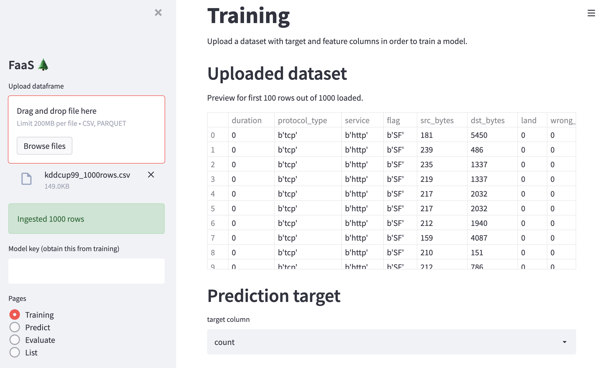
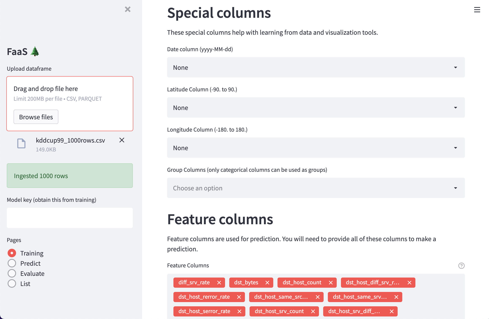
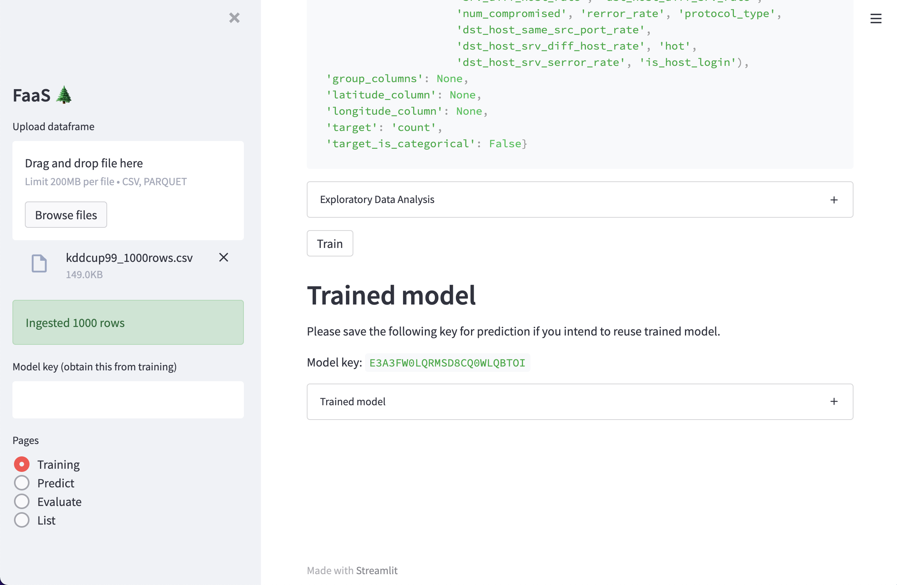
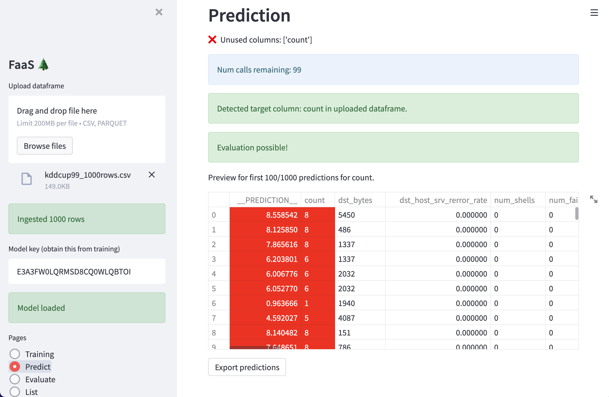
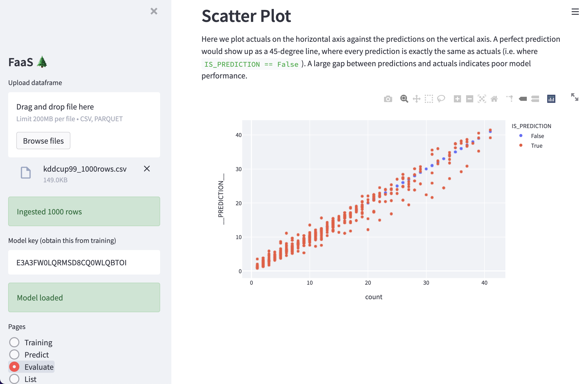

# Forests As A Service
Easy training and prediction service.
```
docker compose up
```
Then navigate to the [ui](http://localhost:8501).


# Guide

Start by uploading a dataset.


Configure model training by specifying what the target and features columns and setting special columns.


Train a model.


Run predictions.


Evaluate model performance.

